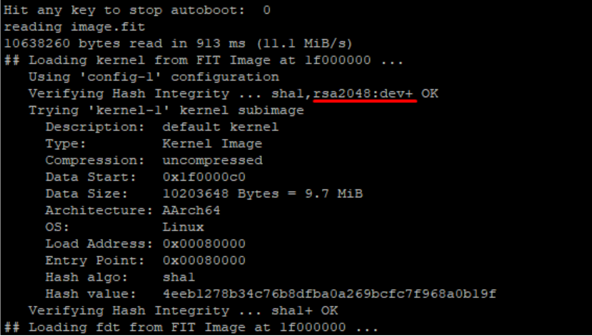

# Introduction 

The following instructions will help you build U-Boot and OPTEE-OS for Raspberry Pi 3 B+ on a Linux host and enable Verified boot.
We built this on Ubuntu 18.04.0. 

## Part 1 - Building OPTEE-OS

### Install the prerequisite packages 

```
sudo add-apt-repository universe
```
```
sudo apt-get install android-tools-adb android-tools-fastboot autoconf     automake bc bison build-essential cscope curl device-tree-compiler     expect flex ftp-upload gdisk iasl libattr1-dev libcap-dev     libfdt-dev libftdi-dev libglib2.0-dev libhidapi-dev libncurses5-dev     libpixman-1-dev libssl-dev libtool make     mtools netcat python-crypto python-serial python-wand unzip uuid-dev     xdg-utils xterm xz-utils zlib1g-dev git
```

### Setup the Repo tool 

```
mkdir ~/bin
PATH=~/bin:$PATH
curl https://storage.googleapis.com/git-repo-downloads/repo > ~/bin/repo
chmod a+x ~/bin/repo
git config --global user.name "Your Name"
git config --global user.email "Your email"
```

### Get and build the OPTEE-OS source code and toolchains 

Note: we’re using OPTEE 3.2 because newer versions cause a number of issues with later steps.

```
mkdir -p $HOME/devel/optee
cd $HOME/devel/optee
repo init -u https://github.com/OP-TEE/manifest.git -m rpi3.xml -b 3.2.0
repo sync
cd build
```

We need to fix a dependency issue in the makefile (see [https://github.com/OP-TEE/build/issues/325](https://github.com/OP-TEE/build/issues/325)):

```
git remote add jbech https://github.com/jbech-linaro/build.git
git remote update
git checkout jbech/3.2.0-dependency-fix
```

Then we can build:

```
make toolchains
make
```

### Downgrade SSL to compile U-Boot with FIT support

Because of a bug, we need to install an older version of libssl to compile the U-Boot with FIT signing support:

```
apt install libssl1.0-dev -y
```

## Part 2 - Implementing Verified boot

### Create the Image Source File (ITS)

Next to the `optee` folder, create a new folder - we call it `fit`.

```
mkdir fit
cd fit
```

Now create the file `image.its` and paste the following contents: 

```
/dts-v1/;
/ {
    description = "RPi FIT Image";
    #address-cells = <2>;
    images {
        kernel-1 {
            description = "default kernel";
            data = /incbin/("Image");
            type = "kernel";
            arch = "arm64";
            os = "linux";
            compression = "none";
            load =  <0x00080000>;
            entry = <0x00080000>;
            hash-1 {
                algo = "sha1";
            };
        };
        tee-1 {
            description = "atf";
            data = /incbin/("optee.bin");
            type = "standalone";
            arch = "arm64";
            compression = "none";
            load =  <0x08400000>;
            entry = <0x08400000>;
            hash-1 {
                algo = "sha1";
            };
        };
        fdt-1 {
            description = "device tree";
            data = /incbin/("bcm2710-rpi-3-b.dtb");
            type = "flat_dt";
            arch = "arm64";
            compression = "none";
            hash-1 {
                algo = "sha1";
            };
        };
    };
    configurations {
        default = "config-1";
        config-1 {
            description = "default configuration";
            kernel = "kernel-1";
            loadables = "tee-1";
            fdt = "fdt-1";
            signature-1 {
                algo = "sha1,rsa2048";
                key-name-hint = "dev";
                sign-images = "fdt", "kernel", "loadables";
            };
        };
    };
};
```

### Create a new key pair 

We need to generate an RSA key pair with OpenSSL to sign our configuration. Generate the keys in directory fit/keys:

```
mkdir keys
openssl genrsa -F4 -out keys/dev.key 2048
openssl req -batch -new -x509 -key keys/dev.key -out keys/dev.crt
```

### Copy the DTB and the OPTEE image 

```
ln -s ../optee/linux/arch/arm64/boot/dts/broadcom/bcm2710-rpi-3-b.dtb
ln -s ../optee/linux/arch/arm64/boot/Image
ln -s ../optee/arm-trusted-firmware/build/rpi3/debug/optee.bin
cp ../optee/linux/arch/arm64/boot/dts/broadcom/bcm2710-rpi-3-b.dtb bcm2710-rpi-3-b-pubkey.dtb
```

### Build U-Boot 

```
cd ../optee/build
make EXT_DTB=../../fit/bcm2710-rpi-3-b-pubkey.dtb rpi3-u-boot-bin
```

### Update the U-Boot environment configuration

Add the following lines at the end of the `optee/build/rpi3/firmware/uboot.env.txt` file:

```
boot_fit=bootm ${fit_addr}
fit_addr=0x1F000000
load_fit=fatload mmc 0:1 ${fit_addr} image.fit
mmcboot_old=run load_kernel; run load_dtb; run load_firmware; run set_bootargs_tty set_bootargs_mmc set_common_args; run boot_it
mmcboot=run load_fit; run set_bootargs_tty set_bootargs_mmc set_common_args; run boot_fit
nfsboot_old=usb start; dhcp ${kernel_addr_r} ${tftpserverip}:Image; dhcp ${fdt_addr_r} ${tftpserverip}:${fdtfile}; dhcp ${atf_load_addr} ${tftpserverip}:${atf_file}; run set_bootargs_tty set_bootargs_nfs set_common_args; run boot_it
nfsboot=usb start; dhcp ${fit_addr} ${tftpserverip}:image.fit; run set_bootargs_tty set_bootargs_nfs set_common_args; run boot_fit
```

### Enable FIT support

Add the following lines to  the `optee/u-boot/configs/rpi_3_defconfig` file:

```
CONFIG_OF_CONTROL=y
CONFIG_FIT=y
CONFIG_FIT_SIGNATURE=y
CONFIG_RSA=y
```

Add the following line to support larger FIT images in the file `optee/u-boot/include/configs/rpi.h`:

```
#define CONFIG_SYS_BOOTM_LEN (16 << 20)
```

The relevant part should look like this:

```
/* ATAGs support for bootm/bootz */
#define CONFIG_SETUP_MEMORY_TAGS
#define CONFIG_CMDLINE_TAG
#define CONFIG_INITRD_TAG
#define CONFIG_SYS_BOOTM_LEN (16 << 20)
```

### Create and sign the FIT image 

```
cd ../../fit
../optee/u-boot/tools/mkimage -f image.its image.fit
../optee/u-boot/tools/mkimage -F -k keys/ -K bcm2710-rpi-3-b-pubkey.dtb -r image.fit
```

### Rebuild the U-Boot binary with the DTB containing the public key

```
make u-boot-clean rpi3-u-boot-bin-clean rpi3-head-bin-clean
make EXT_DTB=../../fit/bcm2710-rpi-3-b-pubkey.dtb u-boot rpi3-u-boot-bin
```

## Part 3 - Preparing the SD card

### Partition the SD card 

Tip: If you’re using a VM, you can mount the SD card as a hard disk.


```
fdisk /dev/sdx   # where sdx is the name of your sd-card
   > p             # prints partition table
   > d             # repeat until all partitions are deleted
   > n             # create a new partition
   > p             # create primary
   > 1             # make it the first partition
   > <enter>       # use the default sector
   > +128M         # create a boot partition with 32MB of space
   > n             # create rootfs partition
   > p
   > 2
   > <enter>
   > <enter>       # fill the remaining disk, adjust size to fit your needs
   > t             # change partition type
   > 1             # select first partition
   > e             # use type 'e' (FAT16)
   > a             # make partition bootable
   > 1             # select first partition
   > p             # double check everything looks right
   > w             # write partition table to disk.
```

### Format the SD card and copy files 

Format the SD card and copy the files to the boot and rootfs partitions. 

**Note: Make sure to replace sdX1 and sdX2 with the correct partitions in your system.**

```
mkfs.vfat -F16 -n BOOT /dev/sdX1
mkdir -p /media/boot
mount /dev/sdX1 /media/boot
cd /media
gunzip -cd /root/devel/optee/build/../out-br/images/rootfs.cpio.gz | sudo cpio -idmv "boot/*"
umount boot
```

```
mkfs.ext4 -L rootfs /dev/sdX2
mkdir -p /media/rootfs
mount /dev/sdX2 /media/rootfs
cd rootfs
gunzip -cd /root/devel/optee/build/../out-br/images/rootfs.cpio.gz | sudo cpio -idmv
rm -rf /media/rootfs/boot/*
cd .. && umount rootfs
```

```
mkdir -p /media/boot
mount /dev/sdX1 /media/boot
cd /media/boot/
cp /root/devel/optee/out/uboot.env .
cp /root/devel/optee/u-boot/u-boot-rpi.bin .
cp /root/devel/fit/image.fit .
cd .. && umount /dev/sdX1
```

## Part 4 - Test! 

Insert your SD card in the RPi3. If everything went smoothly and Verified Boot was correctly configured, output from U-Boot should look like this:



The important part is the rsa2048:dev+ OK, which shows that the configuration signature verification was performed succesfully.


